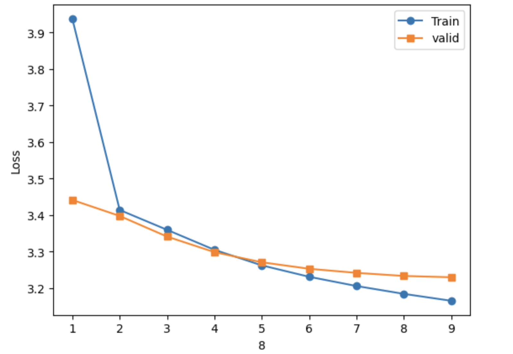

```
Embedding_word2vec/
├─ data/                                  # Artifacts & small fixtures
│  ├─ embed_in.pt                         # Learned input vectors  (|V| × d)
│  ├─ embed_out.pt                        # Learned output vectors (|V| × d)
│  ├─ train_starts.bin                    # Start offsets of train docs/spans
│  ├─ valid_starts.bin                    # Start offsets of valid docs/spans
│  ├─ vocab.pt                            # {old id -> new id, token -> id, id -> token, freq, keep probs, ...}
│  └─ test_embed/                         # toy set for smoke test
│     ├─ n_corpus.bin                     # 
│     ├─ o_corpus.bin
│     └─ vocab.pt
│
├─ srcs/
│  ├─ data_pipeline/                     # Build vocab → encode corpus → ID pipeline
│  │  ├─ _count_fast.pyx                 # Cython: token/bigram counter (pass 1)
│  │  ├─ _encode_corpus.pyx              # Cython: encode to token IDs (pass 2)
│  │  ├─ count_tokens.py                 # func wrapper for _count_fast
│  │  ├─ encode_corpus.py                # func wrapper for _encode_corpus
│  │  ├─ data_pipe_ids.py                # Iterable over (center_id, context_id)
│  │  ├─ review_dataset_iter.py          # Iterator for Reviews_and_TV datasets
│  │  └─ setup.py                        # Build Cython extensions
│  │
│  ├─ embedding/                         # Training
│  │  └─ embedding_ids.py                # SGNS using ID pipeline 
│  │
│  ├─ notebook/                          # Experiments
│  │  ├─ train_reviews_ids.ipynb         # Kaggle reviews_and_TV
│  │
│  └─ test/                              # Verification & speed
│     ├─ semantic.py                     # Simple semantic similarity checks
│     ├─ speedtest.py                    # mul+sum vs bmm vs einsum
│     ├─ test_encode.py                  # Encode-corpus correctness
│     └─ test_fast_count.py              # Counter correctness
│
├─ README.md                              # You are here
└─ LICENSE
```


# Approach

We implement Skip-Gram with Negative Sampling (SGNS) from scratch, with a custom preprocessing pipeline optimized for large corpora.
The pipeline is two-pass:

1. **Count tokens & candidate bigrams**
   - Collect unigram counts
   - Collect top-K high-frequency token pairs

2. **Build final vocab + re-encode corpus**
   - Apply `min_count` threshold
   - Drop tokens not in final vocab
   - Re-encode corpus into integer ID streams

Additionally apply POS-aware bigram merging, which helps preserve meaningful multi-word units:
- NOUN + NOUN, ADJ + NOUN, PROPN + PROPN
- NEGATION + ADJ/ADV (e.g., `not_good`) (skipping auxiliary verbs and intensifiers)
- VERB + PARTICLE (e.g., `pick_up`)

Counts for merged pairs are lightly smoothed before integration.

To improve signal quality, subsampling keep-probabilities are computed with POS-aware masks, reducing noise while preserving sentiment-bearing adjectives/adverbs.

## Key Improvements over Vanilla Word2Vec

- Fast preprocessing via Cython (`_count_fast.pyx`, `_encode_corpus.pyx`)
- POS-aware phrase merging (e.g., `not_good`, `good_movie`, `pick_up`)
- POS-conditioned subsampling keeps important token classes (ADJ/ADV)
- Clean ID pipeline ensures no stray OOV during training
- Simple semantic evaluation

# Training Details

## Objective
We train a Skip-Gram with Negative Sampling (SGNS) model.  
For each center word, the objective increases similarity with real context words and decreases similarity with randomly sampled negative words.  
This encourages semantically related words to lie close in the embedding space.

## Hyperparameters

| Name | Value |
|------|-------|
| Dataset | Movies & TV reviews (HuggingFace) |
| Vocab size | ~43k |
| Embedding dim | 300 |
| Window size | 5 |
| Negative samples | 15 |
| Min frequency | 25 |
| Subsampling | 6e-6 |
| Optimizer | Adam |
| Learning rate | 1e-4 |
| Batch size | 32768 |
| Epochs | 9 |
| Loss | SGNS objective |

## Training Loss Curve
Training loss converged after ~5 epochs.
<p align="center">
  
</p>

# Evaluation
All results use embeddings with the top-2 PCs removed.
## Nearest neighbors
```
happy       → camper, satisfied, pleased
good        → ol'_days, documentry, not_surprising
bad         → guys, horrible, ruined
excellent   → giovanni, suberb, stephan
outstanding → phenomenal, superb, exceptional
masterpiece → finest, must-see, assuredly
awful       → lousy, dreadful, horrible
terrible    → horrible, lousy, ruined
boring      → not_help, predictable, predicable
cringe      → wince, cringeworthy, sophmoric
```

## Analogy
```
king - man + woman → queen, mistress, prince
```

## 2D Embedding Visualization
To qualitatively inspect whether the learned embeddings capture semantic structure,
we project selected word vectors into 2D using PCA.

The plot below shows clusters for several topics such as **animals, vehicles, film/drama, and snacks**.
Even after projection, related words tend to group together, indicating that the model
has learned meaningful semantic relationships.

<p align="center">
  
</p>


## How to Run 
```
# from project root
cd srcs/data_pipeline
python setup.py build_ext --inplace
cd ../../

python srcs/data_pipeline/count_tokens.py
python srcs/data_pipeline/encode_corpus.py
python -m srcs.embedding.embedding_ids
```


